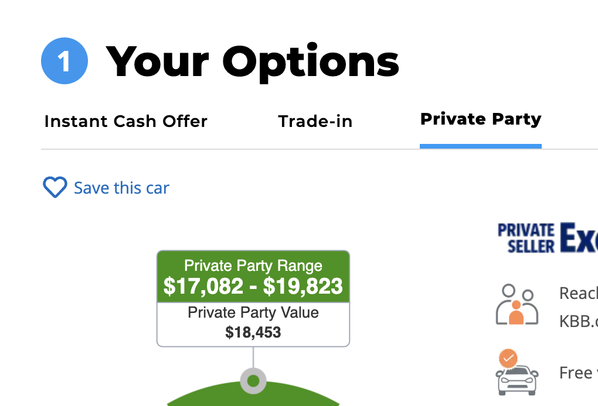
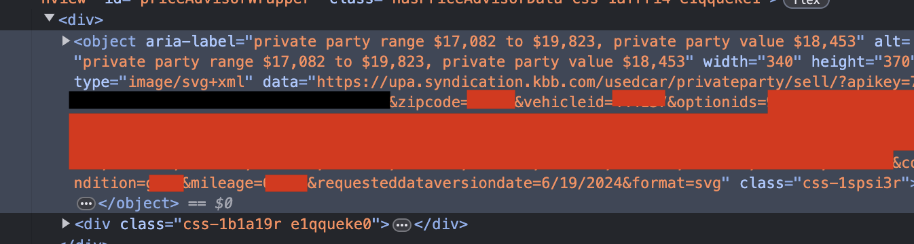

**Note: this script requires having a starting balance in the account**

# Actual Budget Helper Scripts

This is a collection of useful scripts to help you manage your Actual Budget.

- [Requirements](#requirements)
- [Configuration](#configuration)
- [Installation](#installation)
- Scripts:
    - [Sync Remote Banks](#sync-remote-banks)
    - [Loan Interest Calculator](#loan-interest-calculator)
    - [Tracking Home Prices (RentCast's Value Estimate)](#tracking-home-prices-rentcasts-value-estimate)
    - [Tracking Home Prices (Zillow's Zestimate)](#tracking-home-prices-zillows-zestimate)
    - [Tracking Vehicle Prices (Kelley Blue Book)](#tracking-vehicle-prices-kelley-blue-book)
    - [Tracking Investment Accounts](#tracking-investment-accounts)
    - [Tracking Bitcoin Price](#tracking-bitcoin-price)

## Requirements

- [Actual Budget](https://actualbudget.org/)
- [Node.js](https://nodejs.org/) (21.6.2+)
    - [@actual-app/api](https://www.npmjs.com/package/@actual-app/api)
    - [dotenv](https://www.npmjs.com/package/dotenv)
    - [jsdom](https://www.npmjs.com/package/jsdom)
    - [selenium-webdriver](https://www.npmjs.com/package/selenium-webdriver) (for `zestimate.js`)
        - explicitly requires the use of [chromedriver](https://googlechromelabs.github.io/chrome-for-testing/#stable)

## Configuration

Create a `.env` file in the root directory with the following content (or you
can copy the `example.env` file):

```python
ACTUAL_SERVER_URL="https://<Actual Budget server URL>"
ACTUAL_SERVER_PASSWORD="<Actual Budget server password>"
ACTUAL_SYNC_ID="<Actual Budget sync ID>"
# allow self-signed SSL certs
NODE_TLS_REJECT_UNAUTHORIZED=0

# optional, for encrypted files
ACTUAL_FILE_PASSWORD="<file password>"

# optional, if you want to use a different cache directory
ACTUAL_CACHE_DIR="./cache"

# optional, name of the payee for added interest transactions
INTEREST_PAYEE_NAME="Loan Interest"

# optional, name of the payee for added interest transactions
INVESTMENT_PAYEE_NAME="Investment"
# optional, name of the category group for added investment tracking transactions
INVESTMENT_CATEGORY_GROUP_NAME="Income"
# optional, name of the category for added investment tracking transactions
INVESTMENT_CATEGORY_NAME="Investment"

# optional, name of the payee for Zestimate entries
ZESTIMATE_PAYEE_NAME="Zestimate"

# optional, name of the payee for KBB entries
KBB_PAYEE_NAME="KBB"

# optional, the URL for tracking Bitcoin prices
BITCOIN_PRICE_URL="https://api.kraken.com/0/public/Ticker?pair=xbtusd"
# optional, the JSON path in the response to get the Bitcoin price
BITCOIN_PRICE_JSON_PATH="result.XXBTZUSD.c[0]"
# optional, name of the payee for Bitcoin entries
BITCOIN_PAYEE_NAME="Bitcoin Price Change"

#optional, RentCast API key for fetching property data
RENTCAST_API_KEY="<Rentcast API key>"
RENTCAST_PAYEE_NAME="RentCast"
```

### OIDC Auth Provider Support

When using OIDC, in your Actual Budget server config you must be able to log in
with a password.

Set the following in your **server config** (not in your helpers config!), then
on initial login you must set a password:

```
ACTUAL_OPENID_AUTH_METHOD=openid
ACTUAL_LOGIN_METHOD=openid
ACTUAL_ALLOWED_LOGIN_METHODS=openid,password,header
ACTUAL_OPENID_ENFORCE=false
```

Then configure the helpers for password login, as shown above.

## Installation

Run `npm install` to install any required dependencies.

### Using Docker Image

The repository automatically builds and pushes a Docker image of itself every
time the repository is modified or Actual makes a new release.  To use:

```console
docker pull ghcr.io/psybers/actual-helpers
docker run -d --name actual-helpers ghcr.io/psybers/actual-helpers
```

Then you can run specific commands inside the container, e.g.:

```console
docker exec actual-helpers node sync-banks.js
```

### Using Docker Compose

An easier way to run is using Docker compose.  Be sure to create your `.env`
file with all required settings in it.  Then download the compose file
[docker-compose.yml](docker-compose.yml) and run:

```console
docker compose up -d
docker exec -it actual-helpers node sync-banks.js
```

Note that most scripts do not need the `-it` flag, but some might prompt for
input (e.g. the track-investments.js script) and those will require this flag.

### Building Docker Image

This assumes you already have a working version of Docker installed and have
cloned the repo to a location of your choice.

Build the container image:

```console
docker build -t actual-helper ./
```

Test if the Docker container works correctly:

```console
docker run -itd --name actual-helper actual-helper
docker exec actual-helper node sync-banks.js
```

If it is working correctly, the bank sync should run.

## Scripts

Note that most of the scripts utilize account notes to set configuration on
each account.  The scripts will find all accounts that are configured and
update them all in a single call.

### Sync Remote Banks

This script will sync all remote banks that are configured in Actual Budget.
This can be used in place of clicking the "Sync" button in the Actual Budget
app and will ensure your accounts are always up-to-date with
GoCardless/SimpleFIN.

To run:

```console
node sync-banks.js
```

It is recommended to run this script once per day or week.

### Loan Interest Calculator

**Note: this script requires having a starting balance in the account**

This script calculates the interest for a loan account and adds the interest
transactions to Actual Budget.

For each account that you want to automatically calculate interest for, you
need to edit the account notes and add the following tags:

- `interestRate:0.0X` sets the interest rate to X percent (note: be sure to
    enter the rate as a decimal and not a percentage)
- `interestDay:XX` sets the day of the month that the interest is calculated

As an example, if your loan is at 4.5% interest and you want to insert an
interest transaction on the 28th of the month, set the account note to
`interestRate:0.045 interestDay:28`.

By default, interest is calculated using the 30/360 method where interest is
computed monthly using 30/360 (or 1/12) of the interest rate.  If you need to
compute interest using the ACTUAL/ACTUAL method, set `interest:actual` in the
note.  If you need to compute interest daily, set `interest:daily`.

You can optionally change the payee used for the interest transactions by
setting `INTEREST_PAYEE_NAME` in the `.env` file.

To run:

```console
node apply-interest.js
```

It is recommended to run this script once per month.

### Tracking Home Prices (RentCast's value estimate)

This script tracks the RentCast value for a home.  It adds new transactions to
keep the account balance equal to the latest value.  Rentcast values differ
from Zillow since they don't have as complete a database, but they are close in
most cases.

To use this script, you need to create a new account in Actual Budget and set
the account note to populate the fields that RentCast needs: `address`,
`bedrooms`, `bathrooms`, `squareFootage`, and optionally `propertyType` and/or
`compCount`.  Values with spaces and special characters need to be URL encoded,
an online encoder like https://www.urlencoder.org/ is helpful.

`address` needs be one line with commas separating the address lines, then URL
encoded. Supply the number of bedrooms, bathrooms, and square footage for a
more accurate estimate.

Example note using address "123 Example, St Anytown, CA, 12345":
```
address:123%20Example%2C%20St%20Anytown%2C%20CA%20%2C12345
bedrooms:4
bathrooms:2
squareFootage:1600
```

`compCount` defaults to 25 for higher accuracy.  `propertyType` defaults to
"Single Family".  See https://developers.rentcast.io/reference/property-types
for other options.

Optionally, you can also specify if you only own a portion of the home by
adding an `ownership:0.0X` tag to the account note.  For example, if you own
10% of the home, add `ownership:0.10` to the account note.  The script will
then use that percentage to track the home's value.

You will need to create an account on https://app.rentcast.io/app/api and setup
billing for an API Developer plan.  They offer 50 API calls per month for free.
Copy you API key into `RENTCAST_API_KEY` setting the `.env` file.

You can optionally change the payee used for the transactions by setting
`RENTCAST_PAYEE_NAME` in the `.env` file.

To run:

```console
node rentcast.js
```

It is recommended to run this script once per month.

### Tracking Home Prices (Zillow's Zestimate)

This script tracks the Zillow Zestimate for a home.  It adds new transactions
to keep the account balance equal to the latest Zestimate.

To use this script, you need to create a new account in Actual Budget and set
the account note to `zestimate:<Zillow URL>`.  You can find the Zillow URL by
searching for the home on Zillow and copying the URL from the address bar.

For example, if you want to track the Zestimate for a home with the URL
`https://www.zillow.com/homes/123-Example-St-Anytown-CA-12345/12345678_zpid/`,
set the account note to
`zestimate:https://www.zillow.com/homes/123-Example-St-Anytown-CA-12345/12345678_zpid/`.

Optionally, you can also specify if you only own a portion of the home by
adding an `ownership:0.0X` tag to the account note.  For example, if you own
10% of the home, add `ownership:0.10` to the account note.  The script will
then use that percentage to track the home's value.

You can optionally change the payee used for the transactions by setting
`ZESTIMATE_PAYEE_NAME` in the `.env` file.

To run:

```console
node zestimate.js
```

It is recommended to run this script once per month.

### Tracking Vehicle Prices (Kelley Blue Book)

**Note: this script requires having a starting balance in the account**

This script tracks the Kelley Blue Book value for a car or motorcycle.  It adds
new transactions to keep the account balance equal to the latest KBB value.

To use this script, first you need to use the KBB website to find the value of
your car.  Be sure to select "Private Party" for the value.  It should show
something like this:



Then right click on the price and select "Inspect" to view the page HTML.
From there, grab the URL for the image:



Then for your Actual account, set the following tags in the account note based
on the values in the URL.

- `kbbURL:https://upa.syndication.kbb.com/usedcar/privateparty/sell/?apikey=XX-XX-XX-XX-XX`
- `kbbZipcode:XXXXX`
- `kbbCondition:good` (or whatever condition you want to use)
- `kbbMileage:XXXXX` (miles on the car, no commas)
- `kbbDailyMileage:XXXXX` (if given, will auto-update the mileage based on this
  daily average)
- `kbbVehicleid:XXXXXX`
- `kbbOptions:XXX,XXX,XXX,...`

If you are tracking a motorcycle, use these settings:

```
kbbURL:https://www.kbb.com/motorcycles/suzuki/dr650s/2018/?
kbbPriceType:tradein (or retail)
```

Be sure to find the correct URL for your specific motorcycle and year.

You can optionally change the payee used for the transactions by setting
`KBB_PAYEE_NAME` in the `.env` file.

To run:

```console
node kbb.js
```

It is recommended to run this script once per month.  Note that you will have
to periodically update the mileage in the account note.

### Tracking Investment Accounts

**NOTE: This script only works with SimpleFIN accounts.**

This script tracks the value of an investment account.  It adds new
transactions to keep the account balance equal to the latest value.  This
requires connecting to SimpleFIN to grab the reported account balance, so
that the script can update the transactions to reflect that balance.

Note that I have some rules set up on the accounts that the script assumes.
First, all payees are set to the same name "Investment".  Second, any money I
add to the account to fund it I set the category to something different.  In
my case, since I am funding these with my paycheck I categorize them as
"Paycheck" but the key is to set a category different from the ones the script
will utilize.  Then all other transactions are categorized as "Investment".

There are three tags you can set in the account notes:

- `calcInvestment` - this is the tag that tells the script to track the
  balance.  You will want this on each account, and then optionally one of the
  following.
- `zeroSmall` - this is a helper tag that will zero out any small transactions
  (less than $10). This is useful for accounts that have a lot of small
  transactions that you don't want to track.  For example, one of my accounts
  shows dividends as separate transactions, so I use this tag to ignore
  those as my account balance does not actually change when those occur (they
  are reinvested).
- `dropPayments` - this is a helper tag that will zero out anything in the
  payment column.  One of my accounts lists stock purchases as separate
  transactions, so I ignore those as my account balance does not actually
  change when those occur.  But these are typically larger payments and I want
  to keep small payments (interest accrued) so I use this tag on that account
  instead of `zeroSmall`.

Note that the code has a function named `shouldDrop` that might need to be
modified.  This function lists transactions whose note contains certain
strings that are targeted when using `zeroSmall` and `dropPayments`.  You may
need to update this to add additional notes to look for.

You can optionally change the payee used for the transactions by setting
`INVESTMENT_PAYEE_NAME` in the `.env` file.

You can optionally change the category group used for the transactions by
setting `INVESTMENT_CATEGORY_GROUP_NAME` in the `.env` file.

You can optionally change the category used for the transactions by setting
`INVESTMENT_CATEGORY_NAME` in the `.env` file.

You can optionally store the SimpleFIN credentials generated from your setup
token by setting `SIMPLEFIN_CREDENTIALS` in the `.env` file.

To run:

```console
node track-investments.js
```

It is recommended to run this script once per month.

### Tracking Bitcoin Price

This script tracks the value of Bitcoin. It adds new transactions to keep the
account balance equal to the latest value. There is one tag you can set in the
account notes, BTC:X, where X is the number of Bitcoin you own, e.g. `BTC:0.01`
You can optionally change the API endpoint used to retrieve the Bitcoin price,
an example for retrieving the price in GBP is:

```
BITCOIN_PRICE_URL="https://api.kraken.com/0/public/Ticker?pair=xbtgbp"
BITCOIN_PRICE_JSON_PATH=".result.XXBTZGBP.c[0]"
```

To run:

```console
node sync-bitcoin.js
```

It is recommended to run this script once per day or week.

### Tracking Crypto Prices

This script tracks the value of any cryptocurrency. Similar to the Bitcoin
script, it adds new transactions to keep the account balance equal to the
latest value. Values are retrieved from the Kraken API, but the script is
customizable to use other APIs if needed.

To use, set these tags in the account notes:

- `CRYPTO:<symbol>,<symbol>,...` - where each symbol is a cryptocurrency
  you want to track, e.g. `CRYPTO:BTC,ETH,DOGE`
- `<symbol>:<amount>[,<krakenPair>]` - where `<symbol>` is the cryptocurrency
  symbol and `<amount>` is the amount you own. If using Kraken, specify the Kraken
  pair to use for the price. Obtain this by visiting
  [https://api.kraken.com/0/public/Ticker?pair=<symbol\>usd](https://api.kraken.com/0/public/Ticker?pair=btcusd)
  and locating the key under `result` that matches your symbol.

For example, if you own 0.01 BTC and 1 ETH, your account note would look like:
```
CRYPTO:BTC,ETH
BTC:0.01,XXBTZUSD
ETH:1,XXETHZUSD
```

To use a different API, set the following in your `.env` file: (example using Bitcoin)
```shell
CRYPTO_PRICE_URL_BTC="https://api.kraken.com/0/public/Ticker?pair=xbtgbp"
CRYPTO_PRICE_JSON_PATH_BTC="result.XXBTZGBP.c[0]"
```

To run:

```console
node sync-crypto.js
```

It is recommended to run this script once per day or week. If you are retrieving
BTC prices using this script, DO NOT run the `sync-bitcoin.js` script as well, as it will
set the account balance to the value of your BTC holdings only.